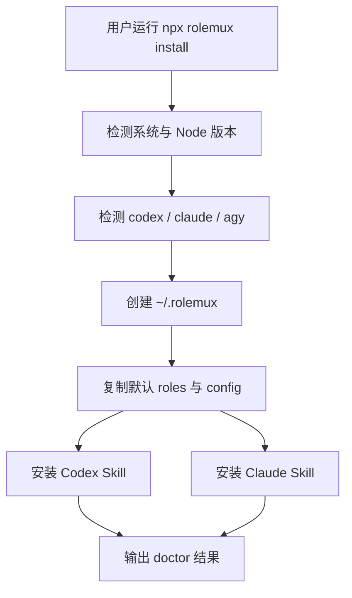
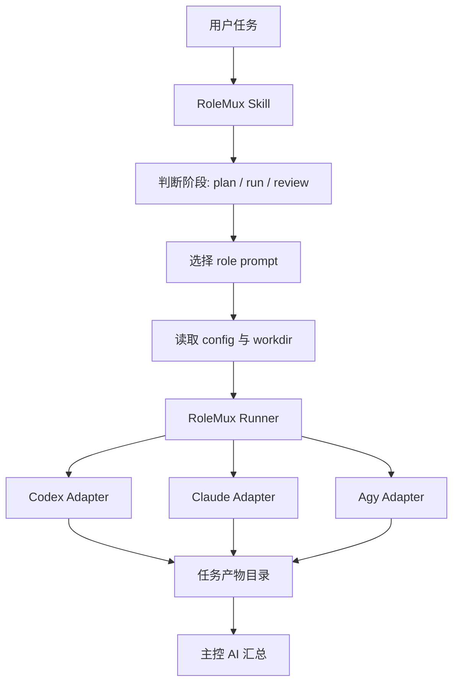
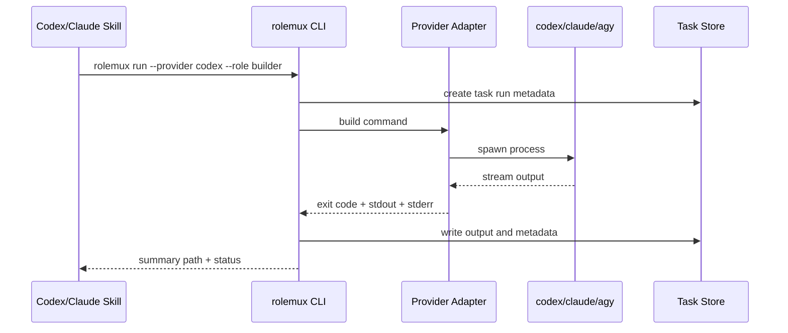
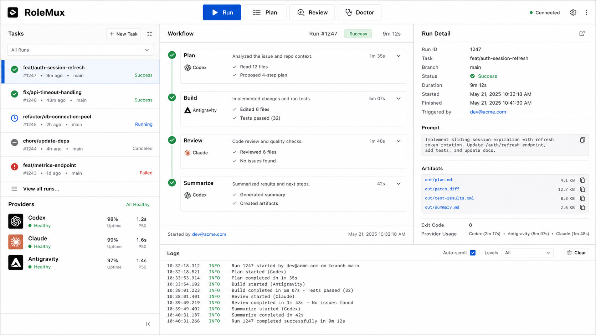

# RoleMux 插件开发文档

版本：v0.1
日期：2026-05-24
项目目录：`C:\Users\peng8\Desktop\Project\Tool\RoleMux`

## 1. 背景与定位

RoleMux 是一个轻量多 CLI 工作流插件/工具包，用于让当前 AI CLI 按角色调用其他 AI CLI 协作完成分析、规划、实现、审查、验证等任务。

它参考 CCG 和 Claude-Code-Workflow 的工作流思想，但不复制重型 `AGENTS.md`、hooks、dashboard、强状态机治理。RoleMux 的目标是提供一个更轻、更易安装、更可控的多 CLI 协作层。

核心定位：

- 通过 npm/npx 安装，提供统一命令 `rolemux`。
- 通过 Codex Skill / Claude Skill 按需触发工作流。
- 通过 runner 统一调用 `codex`、`claude`、`agy` 等 CLI。
- 通过 role prompt 临时赋予不同模型不同职责。
- 通过 `.rolemux/tasks/{task-id}/` 保存任务输入、运行日志、输出和审查结果。
- 默认不修改 `AGENTS.md`，只提供可选安装项。

建议命名：

| 项 | 建议 |
|---|---|
| 项目名 | RoleMux |
| npm 包 | `rolemux` |
| CLI 命令 | `rolemux` |
| Skill 名 | `rolemux-workflow` |
| 全局配置目录 | `~/.rolemux/` |
| 项目任务目录 | `.rolemux/tasks/` |

## 2. 目标与非目标

### 2.1 目标

- 让用户用一个入口调用多个 AI CLI。
- 支持按角色分配任务，例如 architect、builder、reviewer、frontend-reviewer。
- 支持 Codex/Claude Skill 作为工作流入口。
- 支持 npm/npx 一键安装、检查和卸载。
- 支持 Windows 优先，同时兼容 macOS/Linux。
- 保留清晰、可审计的任务产物。

### 2.2 非目标

- MVP 不做完整 CCG 式强制流程治理。
- MVP 不依赖 `AGENTS.md`。
- MVP 不实现复杂 Web dashboard。
- MVP 不强制 native subagent。
- MVP 不代替 Codex/Claude/Antigravity 本身，只负责调度和产物组织。

## 3. 用户角色

| 用户角色 | 诉求 |
|---|---|
| 个人开发者 | 希望一个 CLI 调用多个 AI CLI 协作 |
| AI 工作流研究者 | 希望复刻 CCG/CCW 的轻量版本 |
| 插件作者 | 希望把流程封装成可安装 npm 包和 Skill bundle |
| 代码项目维护者 | 希望把分析、实现、审查分给不同模型 |

## 4. 核心需求说明

RoleMux 应提供三层能力：

1. 安装层
   将 CLI、skills、roles、默认配置安装到本机指定位置。

2. 编排层
   根据用户任务、阶段、目标 provider、role prompt 生成执行请求。

3. 执行层
   调用真实 CLI，收集 stdout/stderr、退出码、耗时和输出产物。

推荐最小链路：

```text
用户任务
  -> Codex/Claude Skill 识别需要多 CLI 协作
  -> 调用 rolemux run/plan/review
  -> RoleMux 读取 config + role prompt
  -> provider adapter 调用 codex/claude/agy
  -> 输出写入 .rolemux/tasks/{task-id}/
  -> 主控 AI 汇总结果给用户
```

## 5. 功能清单

### 5.1 MVP 功能

- `rolemux install`：安装默认配置、roles、Codex Skill、Claude Skill。
- `rolemux uninstall`：卸载 RoleMux 安装的 config、roles 和 Skill bundle，支持 dry-run 与保留 config。
- `rolemux doctor`：检查 `codex`、`claude`、`agy` 是否可用。
- `rolemux run`：按 provider + role 执行一次任务。
- `rolemux plan`：让指定 provider 生成方案。
- `rolemux review`：让指定 provider 审查代码或计划。
- `rolemux status`：查看最近任务状态。
- `rolemux clean`：清理历史任务缓存。
- `rolemux manifest validate`：校验标准 subtask manifest。
- `rolemux split`：把目录或已有 manifest 规范化为标准 subtask manifest。
- `rolemux dispatch`：按 provider worker pool 执行 `readonly` 子任务；`isolated` 子任务在独立 git worktree 中执行并收集 `diff.patch`；也可用 `--dry-run` 预览分发结果。
- `rolemux merge --dry-run`：读取父任务 `diff.patch` 并预览涉及文件，不修改主工作区。
- `rolemux merge --auto-merge`：显式 opt-in，先用 `git apply --check` 检查所有 patch，再应用 clean patch。
- `rolemux worktree cleanup`：按父任务 `worktree.txt` 清理 RoleMux 管理的 isolated worktree，支持 dry-run。
- role 文件管理：内置 roles，可用户覆盖。
- provider 适配器：Codex、Claude、Antigravity/agy。
- 任务产物：保存 prompt、输出、日志、metadata。
- dry-run：只打印将要执行的命令，不真正调用。

### 5.2 增强功能

- 并行执行多个 provider。
- fallback chain，例如 `agy` 失败后改用 `codex`。
- 项目级配置 `.rolemux/config.toml` 覆盖全局配置。
- HTML run report。
- TUI dashboard。
- 可选 `--with-agents` 将简短规则写入 `AGENTS.md`。
- 可选 marketplace/plugin manifest，用于 Codex 插件分发。

## 6. CLI 命令设计

```powershell
# 临时安装
npx rolemux install

# 全局安装
npm install -g rolemux
rolemux install

# 卸载 RoleMux 安装内容
rolemux uninstall --dry-run
rolemux uninstall
rolemux uninstall --keep-config

# 检查环境
rolemux doctor

# 指定 provider + role 执行任务
rolemux run --provider codex --role builder --task task.md --workdir .

# 生成方案
rolemux plan --providers claude,codex --task task.md

# 审查当前改动
rolemux review --provider codex --role reviewer --workdir .

# 并行讨论
rolemux discuss --providers claude,codex,agy --task task.md --mode parallel

# 规范化子任务 manifest
rolemux split --tasks-dir .\tasks --out .\rolemux-tasks.json --dry-run
rolemux manifest validate --manifest .\rolemux-tasks.json

# 预览 worker 分发
rolemux dispatch --manifest .\rolemux-tasks.json --providers codex:2,claude:1 --dry-run

# 执行 readonly/isolated 子任务并写入父/子任务产物
rolemux dispatch --manifest .\rolemux-tasks.json --providers codex:2,claude:1 --workdir .

# 预览合并入口
rolemux merge --parent-task <parent-task-id> --workdir . --dry-run

# 显式应用 clean patch
rolemux merge --parent-task <parent-task-id> --workdir . --auto-merge

# 预览并清理 isolated worktree
rolemux worktree cleanup --parent-task <parent-task-id> --workdir . --dry-run
rolemux worktree cleanup --parent-task <parent-task-id> --workdir .

# 只查看将执行什么
rolemux run --provider claude --role architect --task task.md --dry-run
```

`writePolicy=isolated` 要求 `--workdir` 位于 git work tree 中。RoleMux 会为每个 isolated 子任务创建 `.rolemux/worktrees/{parent-task-id}/{subtask-id}`，provider 在该目录内执行，执行后将 `git diff --binary HEAD` 写入 `.rolemux/tasks/{parent-task-id}/subtasks/{subtask-id}/diff.patch`，并把 worktree 绝对路径写入 `worktree.txt`。`merge --dry-run` 默认只读取并预览这些 patch；只有用户显式使用 `merge --auto-merge` 时，RoleMux 才会对所有 patch 运行 `git apply --check` 并应用 clean patch。`worktree cleanup` 只清理 `worktree.txt` 记录且位于 `.rolemux/worktrees/` 下的 worktree，不删除任务产物或 git branch。当前阶段不自动解决冲突、不支持选择性应用、不自动清理 worktree。

## 7. 推荐目录结构

### 7.1 项目源码结构

```text
RoleMux/
  package.json
  tsconfig.json
  src/
    cli.ts
    commands/
      install.ts
      doctor.ts
      run.ts
      plan.ts
      review.ts
      status.ts
      clean.ts
    core/
      config.ts
      task-store.ts
      prompt-builder.ts
      process-runner.ts
      logger.ts
    providers/
      provider.ts
      codex.ts
      claude.ts
      agy.ts
    roles/
      index.ts
  skills/
    codex/
      rolemux-workflow/
        SKILL.md
    claude/
      rolemux-workflow/
        SKILL.md
  roles/
    architect.md
    builder.md
    reviewer.md
    frontend-reviewer.md
    summarizer.md
  templates/
    config.toml
  spec/
    rolemux-development-spec.md
```

### 7.2 安装后结构

```text
~/.rolemux/
  config.toml
  roles/
  logs/

~/.codex/skills/rolemux-workflow/
  SKILL.md

~/.claude/skills/rolemux-workflow/
  SKILL.md

<project>/.rolemux/tasks/{task-id}/
  task.md
  prompt.md
  output.md
  metadata.json
  runs/
    codex-builder.json
    claude-reviewer.json
```

## 8. 流程图

### 8.1 安装流程



### 8.2 运行流程



### 8.3 Provider 适配流程



## 9. UI 方案

MVP 不需要重 Web UI。建议做两个 UI 层级：

1. 命令行 UI
   用清晰的进度、provider 状态、产物路径和错误摘要即可。

2. HTML Run Report
   每次任务结束可生成 `report.html`，展示任务输入、provider 输出、耗时、状态和后续建议。

后续 TUI/Web UI 可以采用三栏布局：

- 左侧：任务列表、provider 状态、历史运行。
- 中间：当前 workflow timeline。
- 右侧：选中 run 的 prompt、输出、错误、产物路径。
- 顶部：全局命令栏，包含 Run、Plan、Review、Doctor。
- 底部：日志流和快捷命令。

UI 风格建议：开发者工具风格，密度较高，少装饰，突出任务状态和可审计产物。



## 10. 技术方案

### 10.1 推荐技术栈

| 类别 | 方案 |
|---|---|
| Runtime | Node.js 20+ |
| Language | TypeScript |
| CLI 框架 | Commander 或 Clipanion |
| 进程调用 | `execa` |
| 配置校验 | `zod` |
| TOML 解析 | `smol-toml` 或 `@iarna/toml` |
| 日志 | `pino` |
| 测试 | Vitest |
| 打包 | tsup |
| 分发 | npm package |

### 10.2 核心模块

- `config.ts`：加载全局配置和项目配置。
- `prompt-builder.ts`：拼接 role prompt、任务内容、上下文和输出格式要求。
- `process-runner.ts`：统一 spawn、超时、流式输出、退出码处理。
- `task-store.ts`：创建任务目录、写入 metadata、保存产物。
- `providers/*.ts`：不同 CLI 的命令参数适配。
- `commands/*.ts`：用户命令入口。
- `skills/*/SKILL.md`：指导 Codex/Claude 何时调用 RoleMux。

### 10.3 Provider 适配建议

```text
claude:
  claude -p --output-format text "<prompt>"

codex:
  codex exec -C "<workdir>" "<prompt>"

agy:
  agy -p --add-dir "<workdir>" "<prompt>"
```

实际开发时需要用 `doctor` 检测本机 CLI 版本，并针对版本差异做降级提示。

### 10.4 安全策略

- 默认不使用危险权限参数。
- 默认不修改项目文件，除非用户明确使用 write/build role。
- 所有真实命令支持 `--dry-run`。
- role prompt 中明确写入边界：只能做分配的职责。
- 写操作必须传入 `--workdir`。
- 不读取或输出密钥类环境变量。
- 子进程输出要保存原文，同时给用户摘要。

## 11. Skill 设计

### 11.1 触发条件

Codex/Claude Skill 在以下场景触发：

- 用户要求多 CLI 协作。
- 用户要求 Claude/Codex/Antigravity 互相调用。
- 用户要求按角色分配 AI 工具。
- 用户要求 plan/review/implement 分工。

### 11.2 Skill 行为

```text
1. 判断用户目标属于 plan / run / review / discuss。
2. 选择 provider 与 role。
3. 生成任务文件或读取用户指定 task。
4. 调用 rolemux CLI。
5. 读取输出产物。
6. 汇总为用户可读结果。
```

### 11.3 Skill 不应承担的职责

- 真实 CLI 参数细节。
- 大量硬编码 provider 规则。
- 大型状态机。
- 强制修改 `AGENTS.md`。

## 12. 数据结构

### 12.1 `metadata.json`

```json
{
  "taskId": "2026-05-24-001",
  "command": "run",
  "provider": "codex",
  "role": "builder",
  "workdir": "C:/Users/peng8/Desktop/Project/Tool/RoleMux",
  "startedAt": "2026-05-24T10:00:00.000Z",
  "finishedAt": "2026-05-24T10:01:20.000Z",
  "durationMs": 80000,
  "exitCode": 0,
  "status": "success",
  "artifacts": {
    "prompt": "prompt.md",
    "output": "output.md",
    "stderr": "stderr.log"
  }
}
```

### 12.2 `config.toml`

```toml
default_provider = "codex"
default_workdir = "."
task_dir = ".rolemux/tasks"
timeout_seconds = 600

[providers.codex]
enabled = true
command = "codex"

[providers.claude]
enabled = true
command = "claude"

[providers.agy]
enabled = true
command = "agy"
```

## 13. 开发里程碑

| 里程碑 | 内容 |
|---|---|
| M0 | 项目初始化，完成 package、TypeScript、lint/test/build 基础设施 |
| M1 | CLI 骨架，完成 `install`、`doctor`、`run --dry-run` |
| M2 | Provider MVP，完成 Codex、Claude、Agy 三个 adapter 的真实调用 |
| M3 | 任务产物，完成 `.rolemux/tasks/{task-id}` 保存、metadata、日志、输出 |
| M4 | Skill Bundle，完成 Codex Skill、Claude Skill、默认 roles、安装复制逻辑 |
| M5 | 工作流命令，完成 `plan`、`review`、`discuss`、并行执行、fallback |
| M6 | 报告与打包，完成 HTML report、npm publish 准备、README、示例 |

## 14. 验收标准

### 14.1 安装验收

- `npx rolemux install` 可执行。
- `~/.rolemux/config.toml` 被创建。
- 默认 roles 被安装。
- Codex Skill 被复制到正确目录。
- Claude Skill 被复制到正确目录。
- 重复执行 install 不破坏用户已有配置。
- `rolemux uninstall --dry-run` 可列出将删除的 config、roles 和 Skill 目录，不产生删除副作用。
- `rolemux uninstall` 只删除 RoleMux 明确安装的路径，不删除用户项目文件和 `AGENTS.md`。
- `rolemux uninstall --keep-config` 保留 `~/.rolemux/config.toml`。

### 14.2 环境验收

- `rolemux doctor` 能检测 `codex`、`claude`、`agy`。
- 缺失 CLI 时给出明确安装或跳过提示。
- Windows PowerShell 下路径带空格也能正常处理。

### 14.3 执行验收

- `rolemux run --dry-run` 输出正确命令。
- `rolemux run --provider codex --role builder --task task.md` 可执行并保存输出。
- provider 失败时保存错误日志和退出码。
- 超时任务能被终止并标记 `timeout`。
- `--workdir` 生效，且不会误写到其他目录。

### 14.4 产物验收

- 每次 run 都有唯一 task id。
- `prompt.md`、`output.md`、`metadata.json` 均存在。
- metadata 中包含 provider、role、workdir、duration、exitCode。
- `status` 能读取最近任务。

### 14.5 Skill 验收

- Codex 中能识别 RoleMux 工作流触发场景。
- Skill 会调用 `rolemux`，而不是直接硬编码复杂 CLI。
- Skill 输出能引用任务产物并汇总结果。
- 不依赖 `AGENTS.md` 也能工作。

### 14.6 安全验收

- 默认不使用危险 bypass/sandbox 参数。
- dry-run 不产生任务执行副作用。
- 不打印密钥环境变量。
- 不在未经允许时修改 `AGENTS.md`。
- 写入范围限定在 `~/.rolemux` 和当前项目 `.rolemux`。

## 15. 测试清单

### 15.1 单元测试

- 配置加载：全局配置、项目配置、默认值、非法配置。
- prompt 拼接：role + task + context 顺序正确。
- provider adapter：命令参数生成正确。
- task store：目录创建、metadata 写入、重复 id 处理。
- process runner：成功、失败、超时、stderr 捕获。

### 15.2 集成测试

- mock `codex/claude/agy` 可执行文件，验证 spawn 参数。
- `rolemux doctor` 在 CLI 存在/缺失时输出正确。
- `rolemux run --dry-run` 不创建真实运行输出。
- `rolemux run` 能完整生成任务产物。
- `npm run test:e2e` 使用 mock provider 完成 install -> run -> status -> clean -> uninstall 发布验收流。

### 15.3 端到端测试

- 在 Windows PowerShell 中执行 install/doctor/run。
- 在路径含空格的 workdir 中执行任务。
- Codex Skill 调用 `rolemux plan`。
- Claude Skill 调用 `rolemux review`。
- provider 失败后 fallback 可用。

### 15.4 发布测试

- `npm pack` 包含必要文件。
- 全局安装后 `rolemux` 命令可用。
- `rolemux uninstall --dry-run` 可用。
- `npm run verify:release` 可执行 typecheck、unit test、E2E、pack dry-run 和 whitespace check。
- `npx rolemux doctor` 可用。
- README 示例命令可复制执行。

## 16. 风险与约束

主要风险：

- 各 CLI 参数随版本变化，需要 `doctor` 与 adapter 分层缓冲。
- Windows shell quoting 容易出错，必须用 `execa` 参数数组，不拼接命令字符串。
- 模型输出不可控，需要 role prompt 和产物结构稳定约束。
- 并行写同一个项目可能冲突，MVP 应默认分析/审查并行，写操作串行。
- Skill 安装路径可能因用户环境不同而变化，需要可配置。

规避方案：

- 所有 provider 命令集中在 adapter。
- 默认 role 保守，写操作需要明确命令。
- 所有执行可 dry-run。
- 任务产物可审计。
- MVP 优先做稳定 CLI，不先做复杂平台化 UI。

## 17. MVP 完成定义

RoleMux MVP 完成时，应满足：

- 用户能用 `npx rolemux install` 安装。
- 用户能用 `rolemux doctor` 检查环境。
- 用户能用 `rolemux run` 调用 Codex/Claude/Agy 任一 CLI。
- 用户能给任务指定 role prompt。
- 每次执行都有可追踪产物。
- Codex/Claude Skill 能按需调用 RoleMux。
- 不修改 `AGENTS.md` 也能完成核心流程。
